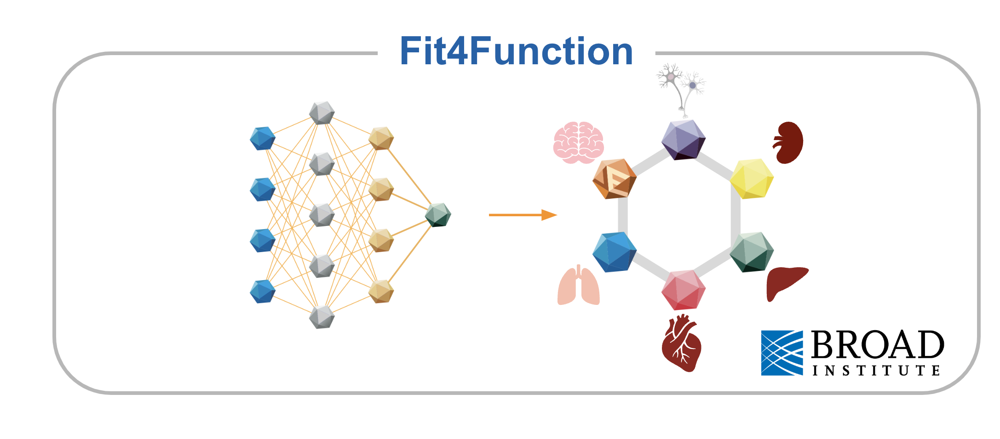

# Fit4Function

Welcome to the Fit4Function repository, provided by Deverman Lab in conjunction with our study "Systematic Multi-Trait AAV Capsid Engineering for Efficient Gene Delivery" _Eid et al., Nature Communications_. This repository encompasses both experimental data and code essential for the replication, validation, and expansion of the Fit4Function study. Source data files necessary to reproduce the manuscript figures are also provided on Zenodo ([https://doi.org/10.5281/zenodo.8388031](https://doi.org/10.5281/zenodo.8388031)). If you have inquiries concerning the code and/or data, please reach out to the corresponding authors of the Fit4Function manuscript.

## Code

This repository includes Jupyter Notebooks that follow the figure sequence and numbering in the main text. These notebooks comprehensively detail the various stages of the research process, such as mapping production fitness, creating and evaluating machine learning models for different functional assays, and validating the Fit4Function and MultiFunction screening and learning outcomes.

A python environment is included with the code, in `environment.yml`. To install the environment, first install the conda package manager and then run `conda env create -f environment.yml`.

## Fit4Function Models

Contained within this repository are trained machine learning models designed for a range of functional assays. The code necessary for training these models is provided within the accompanying Jupyter Notebooks.

## Data

The repository contains various experimental data files essential for understanding and reproducing the study's results. The following datasets are included:

`modeling_library_production_fitness.csv` and `assessment_library_production_fitness.csv`:
AA: Amino acid sequences of variants within each library.
CodonRep1, Codon Rep2: Nucleotide sequences of the two codon replicates representing each 7-mer amino acid sequence variant.
Label: Labels indicating whether a variant is 'Designed' for the uniform set or used for 'Calibration' between the two libraries.
Production1, Production2: Aggregated production enrichment scores for CodonRep1 and CodonRep2, respectively, across technical and biological replicates (without log2 transformation).
Production: Aggregated production enrichment score for the amino acid variant across technical, biological, and codon replicates.

`fit4function_library_invitro.csv`:

A sample of 50,000 RPM values (without log2 transformation) for three replicates of the five in vitro assays discussed in the study. These values result from screening the Fit4Function library in each assay. `_b` indicates binding, and `_t` indicates transduction.

`fit4function_library_invitro_predictions.xlsx`:

Contains measured and predicted log2 enrichment values for five in vitro assays. These values are obtained when an ML model is trained on Fit4Function screening data from each assay and then tested on a different subset of Fit4Function screening data. The testing dataset size is 150,000 variants. `_b` and `_tr` stand for binding and transduction, respectively. Empty cells in the 'Measured' column indicate non-detected variants.

`fit4function_library_invivo.xlsx`:

A sample of 50,000 log2 RPM values measured from the in vivo biodistribution assays involving screening the Fit4Function library in four C57 animals. Each value is averaged across four technical replicates for each organ in each animal. Empty cells within the dataset denote non-detected variants.

`fit4function_library_invivo_predictions.xlsx`:

This dataset presents both measured and predicted log2 enrichment values for the eight in vivo biodistribution assays conducted in C57 mice. These values are obtained when an ML model is trained on Fit4Function screening data from each assay, aggregated across three animals, and subsequently tested on a distinct subset of the Fit4Function variants from the fourth animal.

`fit4function_library_screens.csv`:

Comprising a sample of 100,000 log2 enrichment measurements, this dataset arises from screening the Fit4Function library across the six functions explored in the MultiFunction study. The dataset includes the amino acid sequences of the variants. Additionally, it features Production1 and Production2, which represent log2 enrichment values measured in two separate experiments. `_bind` and `_tr` denotes binding and transduction, respectively. NaN and Inf values signify non-detected variants.

`nnk_library_top_production_fitness_75k.csv` and `nnk_library_top_production_fitness_240k.csv`:

These datasets consist of amino acid sequences for the most abundant 74,500 and 240,000 variants, respectively, detected in the NGS of the NNK starter library.

`nnk_library_invitro.csv`:

Contains a sample of 50,000 RPM values from three replicates for each of the five in vitro assays discussed in the study. These values are a result of screening an NNK library in each assay. `_b` and `_tr` indicate binding and transduction, respectively. The sampled variants are drawn from the most abundant variants in the starter library.

`nnk_library_invitro_predictions.xlsx`:

This dataset presents both measured and predicted log2 enrichment values for assessing ML models trained on NNK screening data for five in vitro assays. `_b` and `_tr` indicate binding and transduction, respectively.

`multifunction_library.csv`:

Contains enrichment measurements for the six liver-targeting functions resulting from screening the MultiFunction library. Variants are labeled with four categories as described in the manuscript. `_b` and `_tr` indicate binding and transduction, respectively.

`multifunction_individual_variants_in_pool.csv`:

Provides measurements for the seven liver-targeting MultiFunction variants in replicates, along with measurements of AAV9 replicates for the six liver-targeting functions and measurements from other organs. This data corresponds to Figure 4d in the manuscript. `Biod` refers to biodistribution in C57 mice, and `invivo` refers to transduction in C57 mice.

`multifunction_nhp_liver_transduction.csv`:

Provides enrichment measurements for biodistribution to the liver in macaques for 100,000 variants from a second Fit4Function library. `Meeting6` indicates whether the variant is (1) or is not (0) predicted to meet the six liver-targeting function criteria using the six models developed earlier in the study for those functions.

`multifunction_variants_hepatocyte_moi3e3_transduction.csv`:

Provides measurements of luciferase activity normalized to AAV9 on a log scale for the seven liver-targeting MultiFunction variants in two cell line transduction assays, each with three replicates.

`transferability.csv`:

Contains true positive rates (TPR), i.e., hit rates, for groups of variants predicted to satisfy sets of criteria across the six liver-targeting functions. A met criterion is indicated by '1,' while '0' signifies a criterion not met. The TPR illustrates the percentage of variants (from the 100,000 Fit4Function library) predicted to satisfy the indicated criteria combination across the six functions that also exhibit functionality (high enrichment) in macaque liver biodistribution.

---

If you have any further questions or need additional assistance, please contact the corresponding authors.
